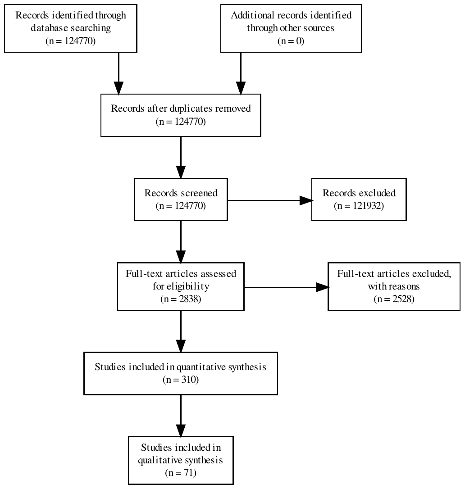
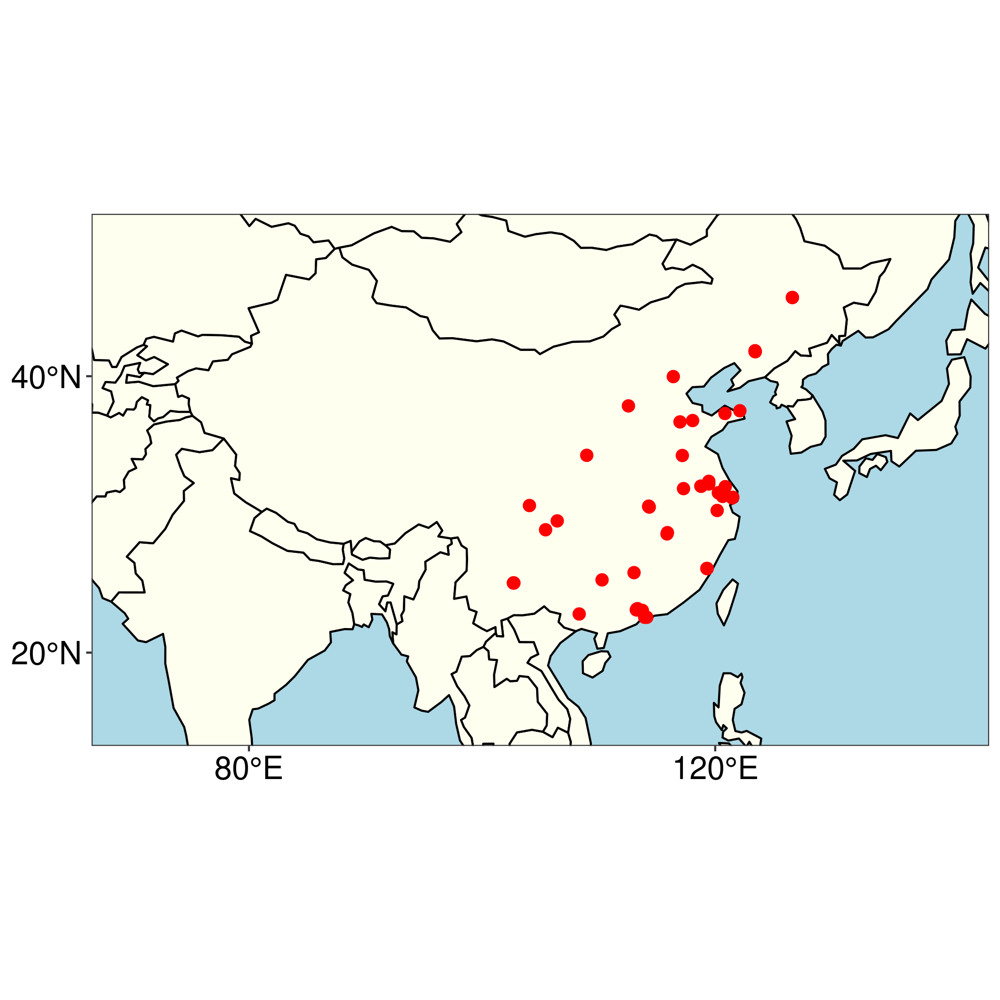

```{r setup, include=FALSE}
# Sys.setlocale("LC_ALL", locale = "chs")
# options(tinytex.clean = FALSE)
# tinytex::latexmk(clean = FALSE)
options(knit.r.table.format = "markdown")

knitr::opts_chunk$set(echo = TRUE, eval = TRUE, cache = TRUE)

library(readr)
library(knitr)
library(tidyverse)
library(flextable)
library(janitor)
library(data.table)
library(scales)
library(glue)
library(here)
options(Encoding="UTF-8")
here <- rprojroot::find_rstudio_root_file()

set_flextable_defaults(font.family = "Arial")

FitFlextableToPage <- function(ft, pgwidth = 6){
  ft_out <- ft %>% autofit()
  ft_out <- width(ft_out, width = dim(ft_out)$widths*pgwidth /(flextable_dim(ft_out)$widths))
  return(ft_out)
}  # With thanks to 'Sarah' on Stack Overflow for this function


n_all_txt_files <- length(list.files(glue("{here}/data/txt")))
n_all_pdf_files <- length(list.files(glue("{here}/data/pdf")))

# Have to hardcode this var. The file in question includes data directly from the database(s) from which the files 
# were accessed, and that information cannot be public at the present time. Underscored dirs and files 
# were put in gitignore to avoid this. 
if(file.exists(glue("{here}/data/_string_match_full_output.csv"))){
  n_all_examined <- fread(glue("{here}/data/_string_match_full_output.csv"))[string_distance < .28][context %like% "供"] %>% distinct(file_name) %>% nrow()
}else{
  n_all_examined <- 310
}

n_all_entries <- as.integer(read_lines(glue("{here}/data/database_nrow.txt")))

bdd_not_included <- fread(glue("{here}/data/bdd_not_included.csv"))
bdd_included <- fread(glue("{here}/appendix_2/bdd_included.csv"))
n_total_not_included <- nrow(bdd_not_included)
n_total_included <- nrow(bdd_included)

n_ventilation <- length(which(grepl("建立.*?呼吸|维持呼吸", fread(glue("{here}/data/bdd_not_included.csv"))$text)))

min_year <- min(bdd_included$year)
max_year <- max(bdd_included$year)

included_hospitals <- fread(glue("{here}/data/hospitals_deduped_w_latlon_clean.csv"))
n_unique_hospitals <- nrow(included_hospitals)
n_military <- nrow(included_hospitals[hospital %like% "军"])
n_unique_hospital_cities <- length(which(grepl("Shi", read_lines(glue("{here}/data/unique_cities_provinces.txt")))))
n_unique_hospital_provinces <- length(which(grepl("Sheng", read_lines(glue("{here}/data/unique_cities_provinces.txt")))))
n_unique_medical_workers <- length(unique(fread(glue("{here}/data/authors_in_bdd_included.csv"))$author_ch))

```

::: {custom-style="affiliation"}
\*Australian National University; Victims of Communism Memorial Foundation. ORCID# 0000-0003-2545-8918
<br><br>\
\*\*Heart Transplantation Unit, Leviev Cardiothoracic Center, Sheba Medical Center; Tel Aviv University Faculty of Medicine. ORCID# 0000-0002-3641-1114
:::

::: {custom-style="phone"}
Corresponding author: Jacob Lavee, Professor of Surgery, Heart Transplantation Unit, Leviev Cardiothoracic Center, Sheba Medical Center, Ramat Gan, Israel

email: [Jacob.Lavee\@sheba.health.gov.il](mailto:Jacob.Lavee@sheba.health.gov.il){.email}
:::
<br><br><br>\
<br><br><br>\

::: {custom-style="phone"}
**Non-standard abbreviations used in this manuscript:**

Dead donor rule (DDR)

Brain death declaration (BDD)
:::

::: {custom-style="phone"}
**Running title:** Execution by organ procurement in China
:::

::: {custom-style="phone"}
**Word count:** 4,389 words (article body); 200 words (abstract) 
:::

\newpage
# Abstract
The dead donor rule is fundamental to transplant ethics. The rule states that organ procurement must not commence until the donor is both dead and formally pronounced so, and by the same token, that procurement of organs must not *cause* the death of the donor. In a separate area of medical practice, there has been intense controversy around the participation of physicians in the execution of capital prisoners. These two apparently disparate topics converge in a unique case: the intimate involvement of transplant surgeons in China in the execution of prisoners via the procurement of organs. We use computational text analysis to conduct a forensic review of `r comma(n_all_txt_files)` papers drawn from a dataset of `r comma(n_all_entries)` Chinese-language transplant publications. Our algorithm searched for evidence of problematic declarations of brain death during organ procurement. We find evidence in `r n_total_included` of these reports, spread nationwide, that brain death could not have properly been declared. In these cases, the removal of the heart during organ procurement must have been the proximate cause of the donor's death. Because these organ donors could only have been prisoners, our findings strongly suggest that physicians in the People's Republic of China have participated in executions by organ removal.

\newpage

# Introduction
A core value in medical ethics is the principle of 'do no harm,' famously captured in the Hippocratic Oath. This principle motivates two widespread professional medical prohibitions: the dead donor rule (DDR), which forbids the procurement of vital transplant organs from living donors,[@Robertson1999-qz; @Groot2010-pe] and the injunction against physician participation in executions.[@Litton2013-kg; @Heath2008-gx]

These two prohibitions are adhered to throughout most of the world: Transplant doctors typically procure organs from free and voluntary donors who have died of natural causes; most countries do not carry out capital punishment.[@Reality_Check_team2020-bx; @Hood2015-ep] Very few countries, even those retaining capital punishment, allow organ donation from condemned individuals.[@Hamilton2012-kq]

But how should we understand the physician's role in a context where executed prisoners are the primary source of transplant organs? Might the transplant surgeon become the *de facto* executioner? Evidence suggestive of such behavior has emerged over many years from the People's Republic of China (PRC).[@Wang2001-ir; @Human_Rights_Watch1994-bf; @Paul2017-qu; @Paul2018-pl; @Tohti2019-qj; @Gutmann2014-cj; @Li2019-lz] To investigate these reports, this paper uses computational methods to examine `r comma(n_all_txt_files)` Chinese transplant-related medical papers published in scientific journals, systematically collecting data and testing hypotheses about this practice. By scrutinizing the clinical procedures around intubation and ventilation of donors, declaration of brain death, and commencement of organ procurement surgery, we contribute substantial new evidence to questions about the role of PRC physicians in state executions.

## Background on human organ transplantation in the PRC

From the 1980s to the present, the PRC developed one of the largest transplantation systems in the world based primarily on organs from prisoners, supplied by the state's security and judicial system.[@Macartney2005-ns; @Huang2008-uc; @Allison2015-hy; @Huang2012-cl] This practice has been condemned by international medical organizations.[@Danovitch2011-zr] The state regards both the number of judicial executions and the true number of transplants as official secrets.[@Smith2020-jv; @Xu2015-du] The identity of all prisoner donors is also unknown, and controversy has long centered on whether non-condemned political prisoners like Falun Gong practitioners and Uyghur Muslims have been used as an organ source.[@China_Tribunal2018-wc]

In the medical literature, China is thought to be the second-largest transplant country in the world as measured by absolute transplant volume, behind the United States.[@Kirk2014-gb; @Hu2019-qy] According to human rights researchers however, China performs even more transplants than the US (which reported over 39,000 in 2020).[@Unos2019-dh; @China_Tribunal2018-wc] PRC hospitals continue to advertise transplant waiting times of weeks, whereas wait times in the US are measured in months and years.[@Nanjing_Drum_Tower_Hospital2021-bv] Hospitals continue to advertise organs to transplant tourists with websites in English, Russian, and Arabic.[@Lovehandy_Healthcare_Service_undated-fj] Chinese authorities now say they will be performing 50,000 transplants by 2023 --- allegedly all from voluntary donors.[@Liu2020-bv] If this transpires, China will be operating the most successful and rapidly growing voluntary transplant program in the world. But Chinese governmental accounts of its organ transplantation sector are often contradictory, and the state has published confusing and demonstrably manipulated datasets to the international community.[@Robertson2019-er] 

## Prisoners as organ donors

The data we rely on in this paper involves transplant surgeries from 1980 to 2015. During this period, there was no voluntary donation system and very few voluntary donors. According to three official sources, including the current leader of the transplant sector, the number of voluntary (i.e. non-prisoner) organ donors in China cumulatively as of 2009 was either 120 or 130, [@Zhao2015-ci; @Beijing_Youth_Daily2015-cv; @Cnn2009-jw] representing only about 0.3% of the 120,000 organs officially reported to be transplanted during the same period (on the assumption that each voluntary donor gave three organs).[@Chen2013-rc; @Huang2012-cl; @Chen2006-ba] The leader of China's transplant sector wrote in 2007 that effectively 95% of all organ transplants were from prisoners.[@Huang2007-md] According to official statements, it was only in 2014 that a national organ allocation system could be used by citizens.[@Wu2015-jx]

The papers we examine typically do not say anything about the donors' identity and do not identify the donors as prisoners. However, based on the above official statements, it logically follows that almost all the organ transplants in the papers we consider must have been from prisoners. Presumably this includes both death row prisoners and prisoners of conscience.[@China_Tribunal2018-wc] The question remains as to how they were executed, and the role of transplant surgeons and other medical workers in that process.

## The challenge of ethically procuring hearts and lungs from prisoners

Hearts and lungs have been chosen for this analysis because their procurement typically entails donors whose hearts are still beating. Under the DDR, ethical procurement of vital organs from heat-beating donors requires the donor to be brain dead. In countries with hospital-based donation systems, brain death is commonly due to stroke, head trauma, or other causes, and is certified prior to procurement. The PRC does not have a brain death law, but Chinese transplant clinicians have published extensively on the topic since the 1980s, translating and discussing definitions and operationalizations of brain death in Japan, England, and the US.[@1986-bd; @1993-zq; @2003-ei; @2004-ab] 

It is unclear how the DDR might apply in cases where vital organs are procured from prisoners. China provides no information about whether, or how, the prisoner-cum-donor is rendered brain dead in preparation for procurement.

Procuring vital organs from prisoners demands close cooperation between the executioner and the transplant team. The state's role is to administer death, while the physician's role is to procure a viable organ. If the execution is carried out without heed to the clinical demands of the transplant, the organs may be spoiled. Yet if the transplant team becomes too involved, they risk becoming the executioners.

Our concern is whether the transplant surgeons establish first that the prisoners are dead before procuring their hearts and lungs. This translates into two empirical questions: (1) Is the donor intubated only after they are pronounced brain dead? And (2) Is the donor intubated by the procurement team as part of the procurement operation? If either were affirmative the declaration of brain death could not have met internationally accepted standards because brain death can only be determined on a fully ventilated patient. Rather, the cause of death would have been organ procurement. 

# Methods

Our data sources for this project were Chinese-language medical papers published in scientific journals. Such papers are available online and through subscription to academic and commercial databases.

The code for cleaning, searching, and extracting the text was written in the `R` statistical programming language by the lead author (MPR), a former interpreter and translator from Chinese. The code and replication files --- pdf and txt files of the Chinese-language clinical reports, the hand-coded xlsx and docx files, processed bib files, and janitorial `R` code --- are hosted on the Harvard Dataverse and GitHub.

## Pilot study

We first conducted a pilot study using highly targeted keyword searches in commercial and academic Chinese-language scientific databases. These searches and the papers they uncovered are presented in Appendix 1. We qualitatively analyzed and classified the resulting 683 papers, during which we developed a criteria for problematic Brain Death Declaration (BDD), and therefore a probable DDR violation. 

We define as problematic any BDD in which the report states that the donor was intubated *after* the declaration of brain death, and/or the donor was intubated *immediately before* organ procurement, as part of the procurement operation, or the donor was ventilated by face mask only.

From this pilot analysis we collected several dozen Chinese-language text strings associated with BDD. In the main analysis, we used computational text analysis to search for similar strings across a much larger corpus.

## Computational text analysis

While the pilot study relied on searches in commercial and academic Chinese scientific databases, the main phase of the study involved searching directly through a large local dataset of Chinese-language medical publications. The full dataset comprises `r comma(n_all_entries)` Chinese transplant-related medical papers collated as part of the lead author's doctoral project. The collection was gathered between late-2018 and October 2020 using dozens of keyword searches for transplant-related terms in several PRC databases, including one that claims 90% coverage of all academic publications in China.

The full dataset covers publications between July 1951 to October 2020. We filtered it for publications from 1980 onwards involving heart and lung transplants from human subjects, leading to a total of `r comma(n_all_pdf_files)` papers. This number was reduced to `r comma(n_all_txt_files)` after subtracting `r comma(n_all_pdf_files - n_all_txt_files)` files for which we could not obtain the full pdf. We converted these `r comma(n_all_txt_files)` pdfs to plain text files using UNIX command-line utilities and optical-character recognition software.

We then developed a fuzzy string matching algorithm in the `R` statistical programming language and used it to search across the corpus for language similar to the text strings identified in the pilot phase.

To avoid extensive manual review, we used a stringent cut-off for string similarity. This meant that only papers that included strings with a Jaro--Winkler distance of less than 0.28 --- i.e. very similar --- to the curated target strings were included, *and* which included the Chinese term "donor" in the surrounding text.[@stringdist] This reduced the number of papers for clerical review from `r comma(n_all_txt_files)` to `r comma(n_all_examined)`.

We then manually reviewed each of these `r comma(n_all_examined)` papers, and qualitatively evaluated them against our criteria for problematic BDD, and therefore likely DDR violations. For these, we excerpted the relevant text, extracted author names and institutions from the reference metadata, removed duplicates, and classified them by institution type and location using geocomputation libraries in `R`.[@ggmap] The relevant excerpts and paper identification data are in Appendix 2. Full references and lists of hospitals and surgeons are available in the project's replication files.

Machine translation was initially used for the problematic BDD excerpts found by our fuzzy matching algorithm. Each translated excerpt was then examined and corrected by the lead author (MPR) and reviewed by two native Chinese speakers familiar with clinical procedures. Both authors then examined, discussed, and coded the papers (with JL relying on translation by MPR).

# Results

Our workflow is illustrated in Figure 1 by the modified Preferred Reporting Items for Systematic Reviews and Meta-Analyses (PRISMA) diagram.^[The modifications to the flowchart are explained in the ./code/05_prisma.R file]

<!-- <br><br><br>\
<center>
{height="100%"}
<center>
<br><br><br> -->

**Fig 1. PRISMA flow chart**

The number of studies with descriptions of problematic BDD was `r comma(n_total_included)`, published between `r min_year` and `r max_year`. Problematic BDD occurred at `r comma(n_unique_hospitals)` hospitals (of which `r n_military` were military) in `r n_unique_hospital_cities` cities across `r n_unique_hospital_provinces` provinces. The geographic spread of these practices is represented in the map of the PRC in Figure 2, with every hospital marked with a red circle. A total of `r n_unique_medical_workers` surgeons, nurses, anesthesiologists and other medical workers or researchers were listed as authors on these publications. 

The complete list of these `r comma(n_total_included)` papers and excerpts with problematic BDD are in Appendix 2. Examples include:

-   "The heart donor was a brain trauma patient. By the time of heart procurement, breathing had ceased. Endotracheal intubation was performed and artificial respiration [established]. The heart beat well. The donor heart was procured …" [@3229]
-   "The donor was intravenously injected with heparin 3mg/kg 1h before the operation... The heartbeat was weak and the myocardium was purple. After assisted ventilation through tracheal intubation, the myocardium turned red and the heartbeat turned strong... The donor heart was extracted with an incision from the 4th intercostal sternum... This incision is a good choice for field operation where the sternum cannot be sawed open without power. "[@0573]
-   "After donor brain death, tracheal intubation was performed as soon as possible for artificial ventilation. The chest was opened quickly, and the ascending aorta and pulmonary artery were infused with cold cardioplegia..."[@3666]
-   "After the donor was confirmed brain dead the trachea was intubated, artificial respiration was established, rapid median sternal incision…" [@0150]
-   "2.1 Obtaining and protecting the donor organs. After the donor's whole body is heparinized, donor is supine, endotracheal intubation is performed through the mouth, and the anesthesiologist intermittently gives oxygen to the lungs by manual balloon pressure. Split the breastbone in the middle..." [@0639]

<!-- <br><br><br>\
<center>
{height="100%"}
<center>
<br><br><br> -->

**Fig 2. Map of the PRC identifying a national pattern of problematic brain death declarations**

# Discussion

We have documented `r n_total_included` descriptions of problematic brain death declaration prior to heart and lung procurement. From these reports, we infer that violations of the DDR took place: given that the donors could not have been brain dead before organ procurement, the declaration of brain death could not have been medically sound. It follows that in these cases death must have been caused by the surgeons procuring the organ.

The `r comma(n_total_included)` papers we identify almost certainly involved breaches of the DDR because in each case the surgery, as described, precluded a legitimate determination of brain death, an essential part of which is the performance of the apnea test, which in turn necessitates an intubated and ventilated patient. In the cases where a face mask was used instead of intubation [@0173; @0191] --- or a rapid tracheotomy was followed immediately by intubation,[@0039] or where intubation took place *after* sternal incision as surgeons examined the beating heart [@0573] --- the lack of prior determination of brain death is even more apparent.

If indeed these papers document breaches of the DDR during organ procurement from prisoners as we argue, how were these donors prepared for organ procurement? The textual data in the cases we examine is silent on the matter. Taiwan is the only other country we are aware of where death penalty prisoners' vital organs have been used following execution. This reportedly took place both during the 1990s and then once more in March 2011.[@Tsai2011-rv; @Rothman1997-rt]

According to a 2011 paper by Tsai et al,[@Tsai2011-rv] executions in Taiwan were typically carried out by firing squad. The prisoner was anesthetized prior to execution, and the bullet was aimed at the prisoner's head to preserve heart function. The prosecutor and a forensic doctor examined the body 20 minutes after the shooting to pronounce legal death. Finally, the prisoner was rushed to a nearby hospital for organ procurement. The problem the authors identify is the unreliable nature of inflicting brain death by firing squad: "The bullet penetrating the temporal bone of skull will not reach the brainstem, so a direct brainstem death could not occur. However, through causing intracranial hemorrhage, which will lead to increased intracranial pressure, herniation of the big brain [sic], and compression of the brainstem, this could possibly cause brainstem death to occur. However, such a means is indirect, imprecise and unreliable."[@Tsai2011-rv 12]

In this scenario, the authors write, cranial damage renders the typical means of establishing brain death --- coma, absence of brainstem reflexes (i.e. pupil movement, facial and tracheal response), and lack of autonomous breathing (ascertained by the apnea test) --- almost impossible. "As a result, when being transferred from execution chamber to hospital for transplantation, the death-row inmates... execution is continued after the firing squad and finished by transplantation surgeons." [@Tsai2011-rv 12]

The Bellagio Taskforce in 1995 gave an even more explicit report of practice in Taiwan, which it says ended in 1994: "in Taiwan the physician sedated and intubated the prisoner and inserted an intravenous line prior to execution. Immediately after the prisoner was shot (in the head), the physician stemmed the blood flow, put the prisoner on the respirator, and injected compounds to raise blood pressure and cardiac output so as to keep the organs perfused. In this way, the physician became an intimate participant in the execution process, functioning not to preserve life but to manipulate death in the service of transplantation."[@Rothman1997-rt]

The Taiwanese case highlights the challenges inherent in complying with the DDR when procuring hearts and lungs from executed prisoners. According to Tsai et al., this only took place with three prisoners in Taiwan before it was stopped.

The PRC papers we have identified do not describe how the donor was incapacitated before procurement, and the data is consistent with multiple plausible scenarios. These range from a bullet to the prisoner's head at an execution site before they are rushed to the hospital, like Tsai's description, or a general anesthetic delivered in the operating room directly before procurement. Paul et al. have previously proposed a hybrid of these scenarios to explain PRC transplant activity: a lethal injection, with execution completed by organ procurement. They write: "in cases in which thiopental’s effect is insufficient and organ explantation begins immediately after cardiac arrest, the inmates may suffer from excruciating pain induced by organ explantation surgery, the surgical opening of the abdomen and/or chest."[@Paul2018-pl] It is also possible that a specialized device was used to inflict brain death in close quarters and thus insulate medical professionals from the process. A patent for a "Primary brainstem injury percussion machine" was held by a former PRC police chief involved in organ transplants.[@Wang2012-pf] The patent description says it was to be used for medium-sized animals. There is no public evidence that it was ever used on humans. Previous anecdotal, eyewitness, and textual evidence is consistent with these accounts --- including procurement from donors prior to death,[@Tohti2019-qj] and targeted execution procedures intended to forestall cardiac arrest and thus minimize warm ischemic time.[@Human_Rights_Watch1994-bf]

A question remains: why did the authors of these papers publish them at all, given the gravity of what they document? We propose this explanation: They are in Chinese, in Chinese academic and commercial databases, and they were produced for a small readership of peers. There are significant technical challenges in accessing the documents at scale. Even then, the DDR violations remain hidden --- a phrase of a few characters in a paper several pages long. Gathering, organizing, discovering, and explaining the significance of this data requires a combination of Chinese-language expertise, technical competence, and knowledge of heart and lung transplant surgery. It is unlikely the authors anticipated these accounts would be compiled and analyzed when they wrote them over a decade ago, though they may have become alert to this possibility in more recent years.

Our data does not allow us to make quantifiable inferences about the representativeness of our sample for all heart and lung procurement surgeries in the PRC. Many of the `r comma(n_all_txt_files)` papers caught in our search were not direct clinical reports. We do not know how many published clinical papers were inadvertently excluded from our analysis. Inadvertent exclusions may have happened for several reasons, including: (1) our failure to capture them from the original Chinese-language repositories, (2) our set of keywords and phrases developed in the pilot study being insufficient to fully capture the underlying phenomenon of interest, (3) our choice to focus on only very close string matches and thus limit the number of papers to closely examine to several hundred only. Further, the most significant inferential gap lies in the fact that we do not know what portion of total heart and lung transplant surgeries actually result in publications. Of these, an even smaller number detail the methods of donor procurement; and of these, only a portion describe the procedures we have discovered.

Many papers we encountered described similar surgical procedures but do not refer to donor brain death or donor intubation.[@3462; @3973; @4124; @0326; @2500; @0332] Papers of this sort are likely the majority of all publications about heart and lung procurement operations. They were only inadvertently caught in our search. 

We identified over two dozen additional papers that described almost identical surgical procedures to the papers we classified as problematic BDD. In these papers, reference is often made (n=`r n_ventilation`) to "establishing ventilation" (建立呼吸) or "maintaining ventilation" (维持呼吸) immediately following the declaration of donor brain death and/or just prior to procurement.[@0591; @0255] These descriptions in fact appear to capture the same clinical procedures as papers we did include, except the term "intubate" is absent.[@0587; @3782; @0476; @0894; @3164; @3124; @0002; @3694]

The only circumstances under which the DDR would not be violated in such cases is if the surgeons adhered to rigorous BDD protocols. In that case, the phrase "establish ventilation" could have referred to turning on the ventilator, not intubating the patient. This would only have been possible if the donor had *already* been intubated and the apnea test performed. However, none of this is described in the papers, despite the otherwise detailed descriptions of routine surgical procedures. Further, if the donor was intubated before determination of brain death, then brain death must have been achieved in a controlled manner --- to prevent cardiac arrest prior to transportation to hospital and procurement --- and surgeons must have insisted on risking the donor’s cardiac death and ischemic damage while conducting the apnea test. This is a possible scenario, but we do not think it is the most plausible or practical one, and we found no evidence for it. Given the number of papers we identified and the clear benefits to transplant success they imply, we think it is most probable that "establish ventilation" simply refers to intubation. It also suggests that problematic BDD, and therefore likely DDR violations, may be more widespread than we can conclusively document.

Apart from the timing of intubation around BDD, there are two other indications of problematic BDD in the papers. These are: (1) establishing venous lines for introducing heparin around intubation time,[@1075; @2458; @4155; @0126] and (2) injecting heparin intramuscularly.[@0099; @0903; @2497] If the donor was a genuine brain-dead patient, venous lines would already have been established before BDD as part of antemortem treatment --- they are never established just before organ procurement. The reference to intramuscular injection of heparin suggests that the donor had no peripheral venous lines before surgery and may even have been ambulant. This is consistent with eyewitness testimony about organ procurement from prisoners;[@Wang2001-ir; @Human_Rights_Watch1994-bf] but it is not consistent with standard procurement procedures in brain dead donors.

During our review, we also came across papers that give clear reports of intubation *prior* to BDD in the context of procurement from reportedly voluntary donors. Such reports, particularly in recent years, are consistent with change of practice in line with official PRC claims of procurement from voluntary donors. (They are also consistent with increased *reporting* of ethical procurement surgery.) An example of such papers: "Three of the donors were normally healthy and in a deep coma, without spontaneous breathing. Mechanical ventilation was maintained through tracheal intubation; the brainstem reflex had disappeared, EEG was flat, and the transcranial Doppler ultrasound showed brain death patterns."[@0623]

Our analysis builds on testimonials of former PRC surgeons like Wang Guoqi and Enver Tohti,[@Wang2001-ir; @Tohti2019-qj] as well as the textual and interview research by investigators and researchers such as Ethan Gutmann, Robin Munro, Li Huige, Paul Norbert, the World Organization to Investigate the Persecution of Falun Gong, and others.[@Gutmann2014-cj; @Human_Rights_Watch1994-bf; @Li2019-lz; @Paul2017-qu; @Paul2018-pl; @Woipfg2014-sr] These sources have highlighted anecdotal and textual accounts of apparent DDR violations by surgeons. Our study, using systematic computational methods, corroborates them.

We think that our failure to identify more DDR violations relates to the difficulty of detecting them in the first instance, not to the absence of actual DDR violations in either the literature or practice. Our choice to tightly focus only on papers that made explicit reports of apparent DDR violations likely limited the number of problematic papers we ultimately identified. We found similar descriptions of intubation and surgical procedures from liver and kidney donors, for instance, but they were not part of our study.[@other_0243; @other_0060; @other_0186; @other_0158] We thus suspect that we captured a tiny sample of a substantial hidden population.

Almost all global health bodies have condemned the use of prisoners for their organs in China.[@World_Medical_Association2006-iq; @OConnell2016-kx] This is primarily due to the belief that the inherently coercive circumstances in which condemned prisoners are held impairs their (or their families') capacity to give free and informed consent to donate organs upon death.[@Caplan2011-fc] 

Chinese officials have alternately defended and criticized their own use of prisoners --- often based on consent. As late as January 2015, the leader of the transplant sector, Dr. Huang Jiefu, told journalists: "I am not saying that I am against prisoners donating. If they found their conscience and want to donate their organs, it is fine, as long as it is within the citizen donation system..."[@Wu2015-jx] Yet just two months later he told a state-affiliated newspaper: "They [*i.e. prisoners*] were forced to donate... The family has to agree, and their parents didn't, they complained, they didn't even agree to the death sentence --- how could they consent to organ donation?"[@Wang2015-th] 

Dr. Huang also attributes the success of organ transplantation in China to the supply of bodies provided by the PRC security apparatus: "We are deeply grateful to the many cadres in the judicial system, because without their cooperation, without organs donated from death row prisoners, China's transplantation system would not be as technologically advanced and mature as it is today."[@Xu2015-cm]

Dr. Huang is on record stating that in the PRC "transplant surgeons have absolutely no involvement with the process of execution."[@Huang2007-md 194] Our research suggests otherwise. If the reports we examine are accurate, they indicate that heart and lung procurement by the surgeon was the proximate cause of the prisoner's death, thus directly implicating the surgeon in the execution.

As of 2021, China's organ transplant professionals have improved their reputation with their international peers. This is principally based on their claims to have ceased the use of prisoners as organ donors in 2015. The international transplantation community seems satisfied with the PRC's progress, and unconcerned with the apparent falsification of official datasets.[@Robertson2019-er] 

While more voluntary donations are taking place in China than ever before, there are as yet no reliable data on the true scale of the reforms. It is also unclear whether and to what degree death row prisoners and prisoners of conscience are still being utilized as organ sources. Given the lack of sanctions and accountability for procurement of prisoner organs in the past, the strong financial incentives to continue such activity, and the difficulty of external observers of detecting it, it is unclear why Chinese hospitals would cease engaging in this profitable trade.

A final question is whether DDR violations continue in the present day. The most recent medical paper we found was published in 2015. There are several potential explanations for this. The most benign is that the reform program indeed ceased the use of prisoners, and thus these abuses. Alternatively, it may be because grassroots human rights activists and researchers exposed DDR violations in September 2014, and PRC officials are attentive to international perceptions.[@Woipfg2014-sr] Instructions to state-managed medical journals to cease publishing such details could have been issued, and this could explain the absence of such admissions past 2015. The authors see no way to objectively adjudicate between these two potential interpretations.

The major unknown is whether prisoners are still being used as an organ source in the PRC. If they are not, then the sort of DDR violations we have identified would naturally no longer occur. But if prisoners --- of whatever sort --- are indeed still being used as an organ source, we think it is most rational to believe that the procurement of their organs continues to occasion violations of the DDR.

\newpage

# Conflict of interest statement
The authors report no conflicts of interest.

# Author contributions
Both authors jointly conceived the study, reviewed all included papers in the study, and developed the categories used in the study. Dr. Lavee was responsible for determining the criteria for problematic BDD papers. Mr. Robertson gathered the data, wrote the code, and performed or confirmed the translations. The authors are jointly responsible for the manuscript.

# Acknowledgements
The authors are grateful for the time and thought of the following people: Wendy Rogers, Tobias Smith, Martin Elliott, Daniel Fu-Chang Tsai, David McGiffin, Benjamin Goldsmith, Katrin Travouillon, Katrine Beauregard, Kenneth Benoit, Bermond Scoggins, Sophia Fang, Raymond L. Hinde, Michael Kumove, and Sarah J. Hinde.

This work was supported by the Google Cloud Research Credits program (award GCP19980904), the Australian Government Research Training Program Scholarship, and the Victims of Communism Memorial Foundation.

# Data availability statement
Replication materials are available on the Harvard Dataverse at https://doi.org/10.7910/DVN/XNGDPE and on GitHub at github.com/mpr1255/dead_donor_replication.

# Supporting Information
- Appendix 1: Pilot study
- Appendix 2: Excerpts from medical papers showing apparent dead donor rule violations

\newpage
# References {-}

<div id="refs"></div>

\newpage
# Figures
<center>
{height="100%"}
<center>
\newpage
<center>
{height="100%"}
<center>
