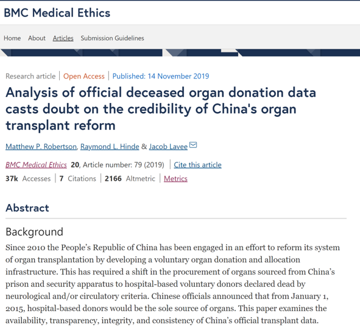
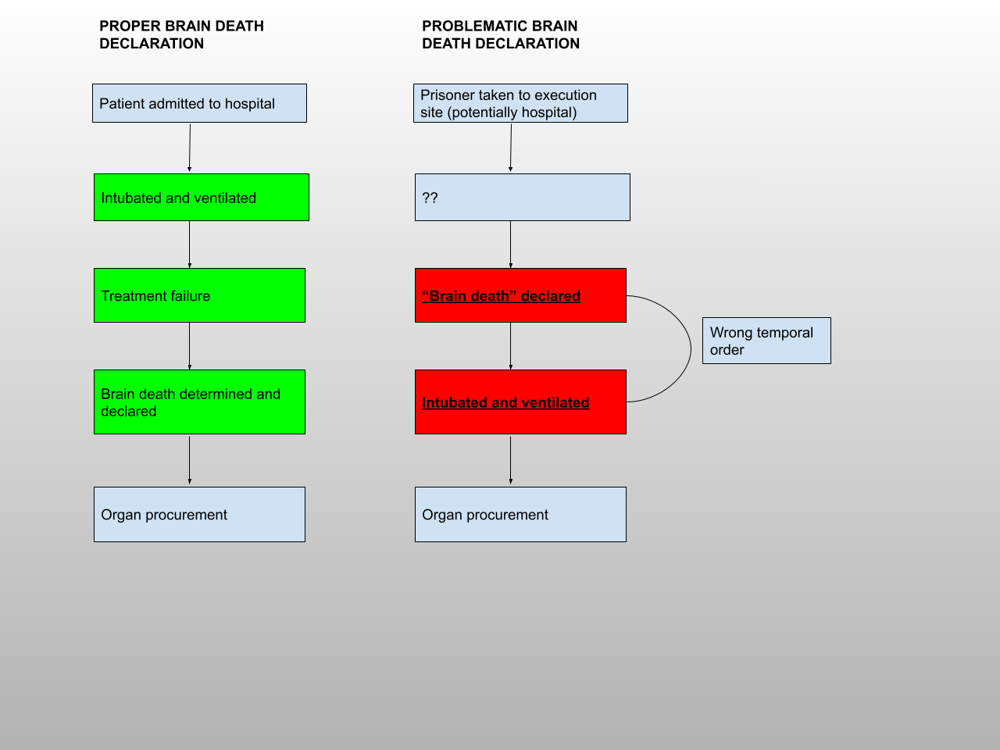
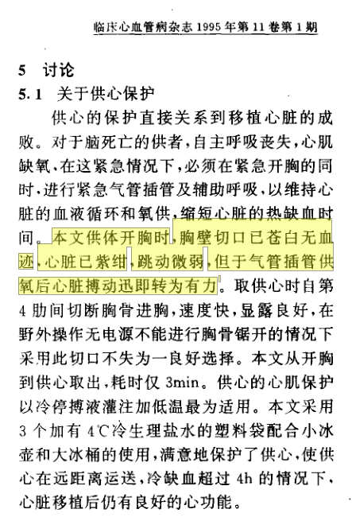
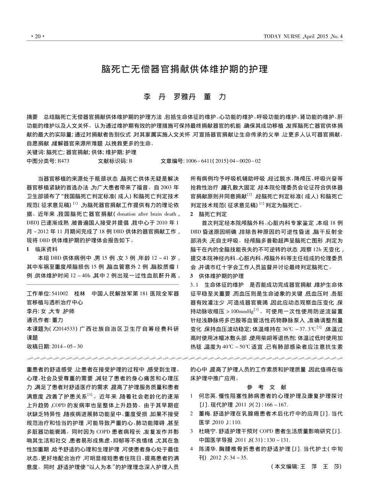
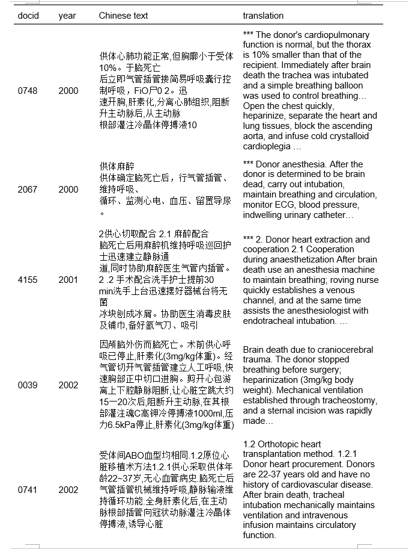
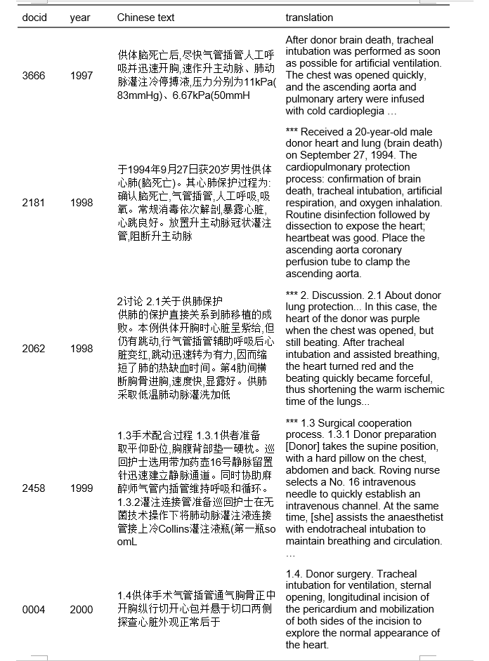

```{r setup, include=FALSE}
knitr::opts_chunk$set(echo = FALSE)
```

## Organ transplantation

- Organ transplantation around the world is typically from voluntary donors

- Developed countries have systems of altruistic giving of organs, with informed consent from donor and/or family

- Legal organ ‘markets’ have been suggested, but never adopted so as to preserve the altruism of the gift of life

- The state enables, encourages, and polices a system of altruistic, voluntary organ donation 

- The state has acted on medical expertise to modify the definition of death in light of advances in transplant therapy (brain death)

## Organ trafficking

“The practice of using exploitation, coercion, or fraud to steal or illegally purchase or sell organs.” (Meshelemiah and Lynch 2019)


- Organ trafficking is considered normatively deviant

- Often carried out by transnational criminal gangs

- Involves kidneys and is from living donors

- States are supposed to criminalise and seek to suppress illicit trafficking activity

## Organ trafficking in China
- China is the only (known) country where state institutions are involved trafficking organs from prisoners on a systematic basis

- Growth of the system began in 1980s-1990s; very rapid expansion in 2000

- Tens of thousands of transplants annually (numbers disputed; claims range from 10,000 - 90,000)

- No legal framework until 2007

- System said to be reformed since 2015 to no longer use prisoners

## Information access and transparency
- Information about transplantation is considered sensitive and secret. 

- Up to 2015 organs claimed to be primarily via judicial executions (death row)

- Significant evidence of extrajudicial killing for organ procurement (political prisoners, other vulnerable populations)

- Data falsification by the state 

## Prior art
```{r bmc, echo=FALSE, out.width = '40%', fig.align = 'left'}

```
- Co-authored with Dr. Jacob Lavee, leading cardiac transplantation surgeon and long-term collaborator

- Key player in reforms to Israeli law that prevented transplant tourism and encouraged domestic donations

## Inside the operating room
- What is the role of the medical professional in this programme? 

- Anecdotes long circulated of surgeon involvement in killing via organ procurement

- In transplant medicine this is a violation of the dead donor rule (DDR). Foundational to transplant ethics

- DDR states donor must be dead when vital organs procured, procurement must not be the cause of death

## Inside the operating room
- If surgeons violate DDR, then they are implicated in the killing of the donor

- The medical establishment then becomes an extension of the coercive and predatory power of the state

- Can these claims be tested?

## Heart and lung procurement
- Involves a donor whose heart is beating

- If heart suffers cardiac arrest, it will in most cases be nonviable in new host

- This differs from kidney procurement after execution at a field site

- High degree of technological sophistication (pre-op, surgery, post-op)

- Demands tight coordination with security authorities who control the prisoner bodies

## The question of death
- Organ procurement from prisoners sits at juncture of medicine and state security

- The state sentences alleged criminals to death -- medical professionals procure and transplant the organs

- PRC officials have long acknowledged the use of prisoners

- But who actually carries out the execution?

- PRC state appears to allow (or force?) medical professionals to do so 

- Health care workers thus become *de facto* state executioners 

## Research design

**Questions:**

1) What evidence would be most strongly diagnostive of physicians carrying out execution via organ procurement?

2) Can it be obtained? 

- Are the prisoners properly declared brain dead?

- This can be answered by asking: when is the donor intubated?

## Research design

- If the prisoner is intubated _after_ being declared brain dead, or _immediately prior_ to procurement surgery, then they could not have been actually dead

- If brain death was not established, then heart procurement by the surgeon would be the proximate cause of death

- Health care workers would have become the executioners

## Appropriate versus problematic declaration of brain death
```{r flowchart, echo=FALSE, out.width = '100%', fig.align = 'center', fig.show="hold"}

```

## Data

- PRC scientists are prolific authors. Publish or perish

- Result: Enormous amount of material with highly explicit descriptions of surgical procedures

- Most useful are clinical reports that give accounts of everyday transplant surgeries

- These case reports would not typically be published in countries with established transplant systems

- Ways for surgeons in a small but rapidly growing field to share knowledge with peers

## Data
```{r example2, echo=FALSE, out.width = '40%', fig.align = 'default', fig.show="hold"}


```

## Data

- Gathered ~124,000 papers like this for thesis

- How to filter those describing surgeon involvement in heart and lung procurement? 

- How to then identify and corroborate specific possible violations?

- Steps: qualitative reading of a sample of papers; identify target strings; scale up the search process with `R`

## Strings
ts_intubation <- as_utf8(c("脑死亡后用麻醉机维持呼吸", "死亡后迅速建立人工呼吸", "自主呼吸丧失的脑死亡供体,在特定条件下应尽可能迅速建立辅助呼吸支持循环,维持供心的血氧供应,避免或缩短热缺血时间,同时迅速剖胸取心", "供体大脑死亡后,首先分秒必争地建立呼吸与静脉通道", "经气管切开气管插管建立人工呼吸", "快速胸部正中切口进胸", "供者脑死亡后迅速建立人工呼吸", "供心保护脑死亡后用麻醉机维持呼吸", "供体确定脑死亡后,气管插管,彻底吸除气道分泌物,用简易呼吸器人工控制呼吸", "供体脑死亡后,迅速建立人工呼吸", "供体脑死亡后快速正中开胸,同时插入气管导管人工通气", "脑死亡后,紧急气管插管", "供者行气管插管", "供者行气管插管,球囊加压通气,静脉注射肝素200mg", "脑死亡后，用麻醉机维持呼吸", "供体在确认脑死亡后,气管插管,建立人工呼吸", "脑死亡后气管紧急插管,纯氧通气", "供体死亡后行人工呼吸、循环支持", "脑死亡后,气管插管", "脑死亡后立即气管内插管给氧", "脑死亡,面罩加压给氧,辅助呼吸", "脑死亡后,将供体取仰卧位,争取做气管插管"，　。。。))

## Algorithm
``` {r, echo = TRUE}
get_string_matches <- function(file_text, target_string){
  res <- afind(file_text, target_string, window = nchar(target_string), method="running_cosine")
  location <- res$location
  distance <- res$distance
  match <- res$match
  context <- substr(file_text, as.integer(location)-70, as.integer(location)+70)
  res2 <- as.data.table(cbind(target_string, location, distance, match, context))
  return(res2)
}
get_full_match <- function(path, file_name, target_strings) {
  file_text <- fread(paste0(path, file_name), sep = NULL, header = FALSE)
  res_afind <- future_map(target_strings, ~get_string_matches(file_text, .x))
  res <- rbindlist(res_afind)
  res3 <- as.data.table(cbind(path, file_name, res))
  names(res3) <- c("path", "file_name", "target_string", "string_location",  "string_distance", "matching_string", "context")
  return(res3)
}
```

## Results
```{r appendix2, echo=FALSE, out.width = '45%', fig.align = 'default', fig.show="hold"}


```

## Findings

- This process whittled it down to a manual review of ~300 papers

- From these, we found 71 instance of apparently problematic, or apparently false, or medically impossible declarations of brain death

- Many cases report intubation after the declaration of brain death

- Many cases report intubation immediately prior to surgery

## Findings

- Recall: if brain death was not effected, then heart procurement must be the proximate cause of death

- We thus infer that these are violations of the dead donor rule 

- Recall: DDR states donor must be dead when vital organs procured, procurement must not be the cause of death

- Violation of the DDR, in procurement from capital prisoners, makes the physician the executioner

## Theoretical contribution

- All regimes claim power over the biological lives of subjects

- Physical integrity rights are not absolute, and the state balances them against its conception of the public good

- The PRC is a deviant case in the realm of organ transplantation, because it has empowered state agents to monetise the bodies of prisoners with little oversight or accountability

- Here, the imperative of a viable transplant (prolonging or saving life of recipient) supersede the rights of the coerced donor

## Theoretical contribution

- In the cases myself and Dr. Lavee have found, the medical establishment is deputised as the executioner --- the execution is effected by heart extraction

- This reflects a highly unique attitude toward the physical integrity of prisoners

- In most cases globally, organ trafficking is a problem of state capacity

- In the PRC case, a high level of state capacity and sophistication instead enables a predatory organ trafficking regime

- An effective and durable authoritarian regime able to provide world-class healthcare to its elite, in this case making highly efficient use of a scarce resource that other countries refrain from exploiting