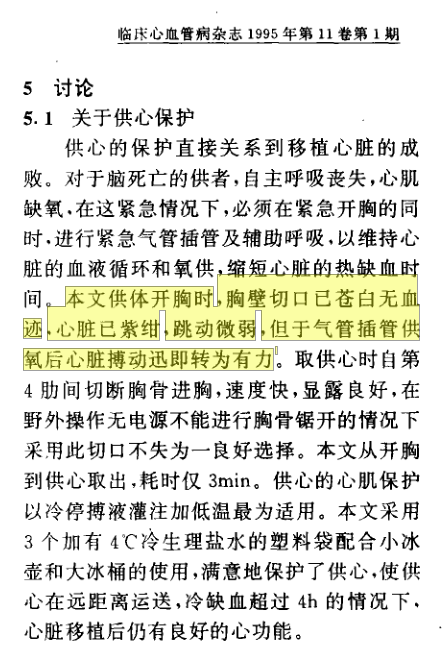
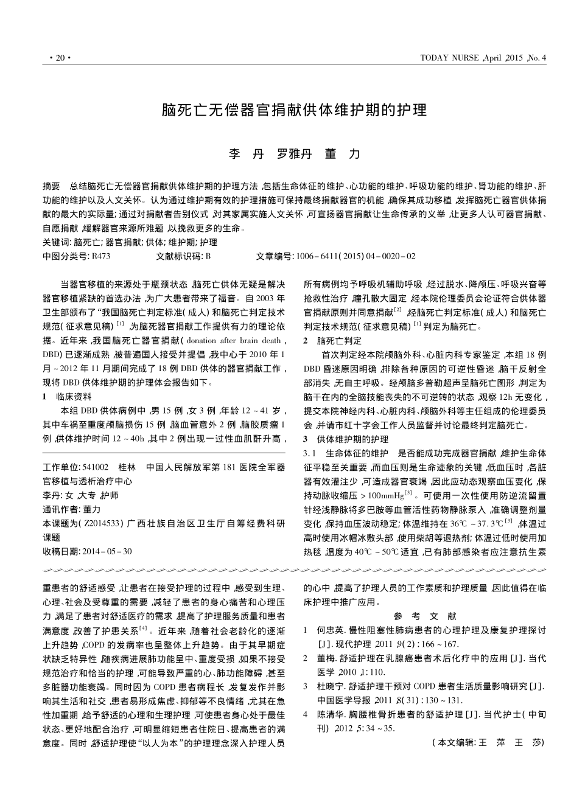

```{r setup, include=FALSE}
knitr::opts_chunk$set(echo = FALSE)
```
# Organ transplantation (Robertson)

- Organ transplantation around the world is typically from voluntary donors

- Developed countries have systems of altruistic giving of organs, with informed consent from donor and/or family

- States enable, encourage, and police a system of altruistic, voluntary organ donation 

# Organ trafficking

“The practice of using exploitation, coercion, or fraud to steal or illegally purchase or sell organs.” (Meshelemiah and Lynch 2019)

- Often carried out by transnational criminal gangs

- Involves kidneys and is from living donors

- States are supposed to criminalise and seek to suppress illicit trafficking activity

# Organ trafficking in China
- China is the only (known) country where state institutions are involved trafficking organs from prisoners on a systematic basis

- Growth of the system began in 1980s-1990s; very rapid expansion in 2000

- Tens of thousands of transplants annually (numbers disputed; claims range from 10,000 - 90,000)

- No legal framework until 2007

- System said to be reformed since 2015 to no longer use prisoners

# Falsified data
```{r bmc, echo=FALSE, out.width = '40%', fig.align = 'left'}
knitr::include_graphics("bmc.png")
```
- Co-authored with Dr. Jacob Lavee, leading cardiac transplantation surgeon and long-term collaborator

- Key player in reforms to Israeli law that prevented transplant tourism and encouraged domestic donations

# Research question: Inside the operating room
- What is the role of the medical professional in this programme? 

- Anecdotes long circulated of surgeon involvement in killing via organ procurement

- In transplant medicine this is a violation of the dead donor rule (DDR). Foundational to transplant ethics

- DDR states donor must be dead when vital organs procured, procurement must not be the cause of death

# Inside the operating room
- If surgeons violate DDR, then they are implicated in the killing of the donor

- The medical establishment then becomes an extension of the coercive and predatory power of the state

- Can these claims be tested?

# Heart and lung procurement
- Involves a donor whose heart is beating

- If heart suffers cardiac arrest, it will in most cases be nonviable in new host

- This differs from kidney procurement after execution at a field site

- High degree of technological sophistication (pre-op, surgery, post-op)

- Demands tight coordination with security authorities who control the prisoner bodies

# Appropriate versus problematic declaration of brain death (Lavee)
```{r flowchart, echo=FALSE, out.width = '100%', fig.align = 'center', fig.show="hold"}
knitr::include_graphics("flowchart.png")
```

# Brain death determination
- An evaluation for brain death should be considered in patients who have suffered a massive, irreversible brain injury of identifiable cause. 
- Brain death is defined as the irreversible loss of all function of the brain, including the brain stem.
- The three essential findings in brain death are coma, absence of brain stem reflexes, and apnea. 

# Brain death determination
- A patient properly determined to be brain dead is legally and clinically dead.
- In the absence of either complete clinical findings consistent with brain death or ancillary tests demonstrating brain death, brain death cannot be diagnosed.
- Organ procurement for transplantation can be commenced only after brain death has been determined or else the organ procurement becomes the mode of execution.

# Brain death determination: coma
- No evidence of responsiveness. 
- Eye opening or eye movement to noxious stimuli is absent. 
- Noxious stimuli should not produce a motor response other than spinally mediated reflexes.

# Brain death determination: coma
- Absence of brain stem reflexes:
    + Absence of pupillary response to bright light in both eyes. 
    + Absence of ocular movements using oculocephalic testing and oculovestibular reflex testing.
    + Absence of corneal reflexes. 
    + Absence of facial muscle movement in response to a noxious stimulus.
    + Absence of pharyngeal (gag) and tracheal (cough) reflexes.

# Brain death determination: apnea test
Before performing the apnea test, the physician must determine that the patient meets the following conditions:

- Core temperature > 36°C or 96.8°F
- PaCO2 35-45 mm Hg
- Normal PaO2 
- Normal blood pressure

# Brain death determination: apnea test
- Connect a pulse oximeter
- Disconnect the ventilator
- Deliver 100% O2, 6 L/min by placing a catheter through the endotracheal tube and close to the level of the carina. 
- Draw a baseline arterial blood gas
- Look closely for respiratory movements (abdominal or chest excursions that produce adequate tidal volumes) for 8-10 minutes
- Measure PaO2, PaCO2, and pH after approximately 8-10 minutes and reconnect the ventilator
- If respiratory movements are absent and PaCO2 is $\geq$ 60 mm Hg, the apnea test supports the diagnosis of brain death
- If respiratory movements are observed, the apnea test result is negative (i.e., does not support the diagnosis of brain death)

# Research design (Robertson)

- If the prisoner is intubated _after_ being declared brain dead, or _immediately prior_ to procurement surgery, then they could not have been actually dead

- If brain death was not established, then heart procurement by the surgeon would be the proximate cause of death

- Health care workers would have become the executioners

# Strings
ts_intubation <- as_utf8(c("脑死亡后用麻醉机维持呼吸", "死亡后迅速建立人工呼吸", "自主呼吸丧失的脑死亡供体,在特定条件下应尽可能迅速建立辅助呼吸支持循环,维持供心的血氧供应,避免或缩短热缺血时间,同时迅速剖胸取心", "供体大脑死亡后,首先分秒必争地建立呼吸与静脉通道", "经气管切开气管插管建立人工呼吸", "快速胸部正中切口进胸", "供者脑死亡后迅速建立人工呼吸", "供心保护脑死亡后用麻醉机维持呼吸", "供体确定脑死亡后,气管插管,彻底吸除气道分泌物,用简易呼吸器人工控制呼吸", "供体脑死亡后,迅速建立人工呼吸", "供体脑死亡后快速正中开胸,同时插入气管导管人工通气", "脑死亡后,紧急气管插管", "供者行气管插管", "供者行气管插管,球囊加压通气,静脉注射肝素200mg", "脑死亡后，用麻醉机维持呼吸", "供体在确认脑死亡后,气管插管,建立人工呼吸", "脑死亡后气管紧急插管,纯氧通气", "供体死亡后行人工呼吸、循环支持", "脑死亡后,气管插管", "脑死亡后立即气管内插管给氧", "脑死亡,面罩加压给氧,辅助呼吸", "脑死亡后,将供体取仰卧位,争取做气管插管"，　。。。))

# Algorithm
``` {r, echo = TRUE}
get_string_matches <- function(file_text, target_string){
  res <- afind(file_text, target_string, window = nchar(target_string), method="running_cosine")
  location <- res$location
  distance <- res$distance
  match <- res$match
  context <- substr(file_text, as.integer(location)-70, as.integer(location)+70)
  res2 <- as.data.table(cbind(target_string, location, distance, match, context))
  return(res2)
}
get_full_match <- function(path, file_name, target_strings) {
  file_text <- fread(paste0(path, file_name), sep = NULL, header = FALSE)
  res_afind <- future_map(target_strings, ~get_string_matches(file_text, .x))
  res <- rbindlist(res_afind)
  res3 <- as.data.table(cbind(path, file_name, res))
  names(res3) <- c("path", "file_name", "target_string", "string_location",  "string_distance", "matching_string", "context")
  return(res3)
}
```

# Raw data
```{r example2, echo=FALSE, out.width = '40%', fig.align = 'default', fig.show="hold"}


```

# Examples from paper (Lavee)

[0573] The donor was intravenously injected with heparin 3mg/kg 1h before the operation. The sternum was transected from the 4th intercostal space into the chest, and the pericardium cut open. **The heartbeat was weak and the myocardium was purple. After assisted ventilation through tracheal intubation, the myocardium turned red and the heartbeat turned strong.** A needle at the root of the ascending aorta was used to perfuse with 1000ml of cold cardioplegic solution at 4c°... **When the chest of the donor in this paper was opened, the chest wall incision was pale and bloodless, and the heart was purple and beating weakly. But the heartbeat became strong immediately after tracheal intubation and oxygenation.**

# Examples from paper

[0191] …weight 65kg, blood type O, the same as the recipient's blood type, brain death via external trauma. **Before the chest is opened, 100mg of heparin is injected and the mask is pressurized to give oxygen to assist breathing.**

[0278] 1. Donor extraction. **After the donor is declared brain dead, put donor in the supine position, strive for tracheal intubation,** quickly disinfect, drape, and cut.

# Conclusion (Robertson)

- Is this ongoing? We do not know. 
- A simple heuristic: if prisoners are no longer being used, then naturally it would not
- If prisoners _are_ still being used, then it would be rational to believe that this practice continues
- We think there is compelling evidence that prisoners are in fact still being used